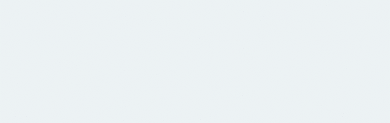

# vue-sequential-entrance
Vuejs Plugin for creating epic sequential animation entrances with a list of elements.
Zero effort.
Really lightweight



## Installation
In order to use into your vue project
```
npm install vue-sequential-entrance
```

## How to use ( Global Usage )
Add to your main.js file
```javascript
import SequentialEntrance from 'vue-sequential-entrance'
Vue.use(SequentialEntrance);
```

And now, in your component file, wrap a list of elements with sequential-entrance tag
```html
<template>
  <sequential-entrance>
    <div class="box" v-for="app in apps" :key="app">{{ app }}</div>
  </sequential-entrance>
</template>
```

Sequential Entrance comes with four 'flavors': animation entrance from Top, from right, from left and from bottom. By default, it uses from right, but you can select what you want this way:
```html
  <sequential-entrance fromTop> [...] </sequential-entrance>

  <sequential-entrance fromRight> [...] </sequential-entrance>

  <sequential-entrance fromBottom> [...] </sequential-entrance>

  <sequential-entrance fromLeft> [...] </sequential-entrance>
```


## Customize with the following Props

###delay
By default, the sequence animation have an interval of 250 milliseconds. If you need a faster or slower entrance animation, you can specify the time in milliseconds.
```
      <sequential-entrance delay="1000"> . . . </sequential-entrance>
```

###tag
By default, sequential-entrance render a <span> tag wrapping its children, but you can customize the wrapper tag through 'tag' prop
```
      <sequential-entrance tag="section"> . . . </sequential-entrance>
```

###animation
If you prefer don't use the built in animations (fromTop,fromRight,fromLeft,fromBottom) and use your custom css animation, you can easily using 'animation' props. Simply, put the class name of your animation and that's it.  
```
      <sequential-entrance animation="myCustomAnimationClassName"> [...] </sequential-entrance>
```

Even you can use css animation libraries like animate.css ( https://daneden.github.io/animate.css/ ). Import the entire css library or only the ones that you are goint to use and type the class name in animation prop.

```
      <sequential-entrance animation="bounceIn"> [...] </sequential-entrance>
```
